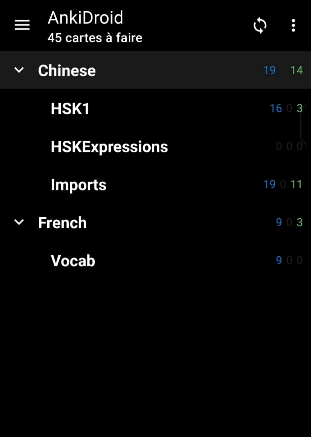
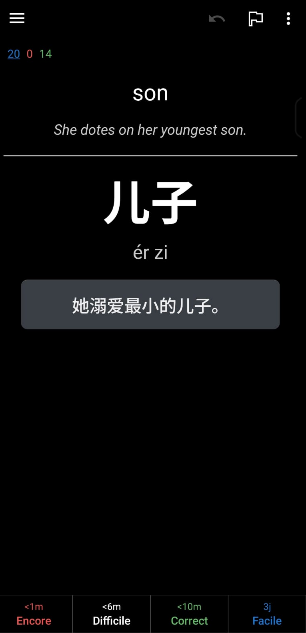
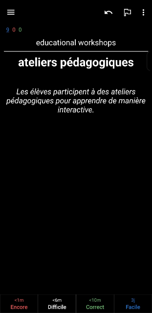

# AnkiNotesCLI

**A general-purpose note-taking CLI tool with AI enrichment and Anki integration for spaced repetition learning.**

Quickly capture concepts, terms, or phrases from any subject, enrich them with AI-generated explanations and examples, and sync them directly to Anki for effective spaced repetition learning.

Perfect for:
- 🌍 Language learning (Chinese, French, Spanish, etc.)
- 💻 Programming concepts and syntax
- 📚 Academic subjects (Biology, History, Math, etc.)
- 📖 General knowledge and vocabulary building

## Features

- **Course-based organization**: Create separate courses for different subjects
- **AI-powered enrichment**: Automatically generate explanations, examples, and usage notes
- **Flexible levels/topics**: Organize notes with custom levels (e.g., HSK 1-6, Beginner/Advanced, Chapter 1-10)
- **Customizable AI prompts**: Tailor AI responses for each course
- **Anki integration**: Seamlessly sync notes to Anki with hierarchical deck structure
- **Simple CLI**: Fast, keyboard-driven workflow

## Screenshots

### Anki Decks Organization


### Chinese Note Example


## Quick Start

```bash
# Set up a course (first time only)
./notes.py course "French"

# Set your current level (optional)
./notes.py level "Beginner"

# Add notes
./notes.py new "ateliers pédagogiques" -c "Les élèves participe à des ateliers pédagogiques pour apprendre de manière interactive"
./notes.py new "C'est la vie" -g "common expression"

# Sync to Anki
./notes.py sync
```



## Installation

### 1. Clone the Repository

```bash
cd ~/
git clone https://github.com/yourusername/lang-anki-cli.git
cd lang-anki-cli
```

### 2. Install Anki

**Linux (Ubuntu/Debian - Recommended):**
```bash
snap install anki-woodrow
```

**Other Linux Distros:**
```bash
# Using Flatpak
flatpak install flathub net.ankiweb.Anki

# Or download from official website
# Visit https://apps.ankiweb.net/
```

**macOS:**
```bash
brew install --cask anki
```

**Windows:**
1. Download from [https://apps.ankiweb.net/](https://apps.ankiweb.net/)
2. Run the installer
3. Follow the installation wizard

### 3. Install AnkiConnect Add-on

1. Open Anki
2. Go to `Tools > Add-ons`
3. Click `Get Add-ons...`
4. Paste in the code: `2055492159`
5. Click **OK** and restart Anki

**Note:** Anki must be running for sync commands to work.

### 4. Set Up Python Environment

```bash
# Create virtual environment
python3 -m venv venv

# Activate it
source venv/bin/activate  # Linux/macOS
# OR
.\venv\Scripts\activate   # Windows

# Install dependencies
pip install -r requirements.txt
```

### 5. Configure Environment Variables

```bash
# Copy example env file
cp env.example .env

# Edit .env and add your OpenAI API key
vim .env  # or use your preferred editor
```

Add your API key:
```ini
OPENAI_API_KEY="sk-..."
```

### 6. Create a System Alias (Optional but Recommended)

For easier access, create an alias:

**Linux/macOS (add to `~/.bashrc` or `~/.zshrc`):**
```bash
alias notes='~/lang-anki-cli/notes.py'
```

**Windows (PowerShell Profile):**
```powershell
function notes { python ~/lang-anki-cli/notes.py $args }
```

After adding the alias, restart your terminal or run `source ~/.bashrc`.

## Usage

### Course Management

#### Create or Select a Course

```bash
notes course "French"
notes course "Python Programming"
notes course "Biology 101"
```

When creating a new course, you'll be asked:
1. Whether it's a language learning course (affects default AI prompt)
2. Option to customize the AI prompt (or use the default)

The AI prompt template is saved in `courses/<course_name>.json` and can be edited anytime.

#### Set Current Level/Topic

```bash
notes level "Beginner"
notes level "HSK 3"
notes level "Chapter 5"
```

Levels are optional but help organize notes into Anki sub-decks and provide context for AI.

### Adding Notes

#### Basic Usage

```bash
notes new "phrase or concept"
```

#### With Context (Example Sentence)

```bash
notes new "être" -c "Je suis étudiant"
notes new "list comprehension" -c "squares = [x**2 for x in range(10)]"
```

The `-c` flag provides context or an example that will appear on your Anki card.

#### With Grammar/Additional Info

```bash
notes new "être" -g "irregular verb, one of the most common verbs"
notes new "mitochondria" -g "powerhouse of the cell, has its own DNA"
```

The `-g` flag adds grammar points or additional learning notes.

#### Combining Both

```bash
notes new "faire" -c "Je fais mes devoirs" -g "irregular -re verb"
```

### Viewing Notes

```bash
# Show last 5 notes
notes list

# Show last 10 notes
notes list -n 10
```

### Syncing to Anki

```bash
notes sync
```

This will:
1. Find all unsynced notes in the current course
2. Create Anki decks (with sub-decks for levels if set)
3. Add cards with AI-generated content
4. Mark notes as synced

## Workflow Examples

### Language Learning (Chinese)

```bash
# Initial setup
notes course "Chinese"
notes level "HSK 3"

# Add vocabulary
notes new "一寸光阴 一寸金"
# AI generates: pinyin, translation, example, grammar notes

notes new "熟能生巧" -g "idiom about practice"

# Sync to Anki deck: Chinese::HSK 3
notes sync
```

### Programming (Python)

```bash
notes course "Python"
notes level "Advanced"

# Add concepts
notes new "decorator" -c "@property\ndef name(self): return self._name"
# AI generates: explanation, example, important details

notes new "generator" -g "uses yield, lazy evaluation"

notes sync  # → Anki deck: Python::Advanced
```

### Academic Subject (Biology)

```bash
notes course "Biology 101"
notes level "Cell Biology"

notes new "mitochondria" -g "powerhouse of the cell"
notes new "ribosomes" -c "found in cytoplasm and on ER"

notes sync  # → Anki deck: Biology 101::Cell Biology
```

## Customizing AI Prompts

Each course has a customizable AI prompt template stored in `courses/<course_name>.json`.

**Available placeholders:**
- `{course}` - Course name
- `{phrase}` - The term/concept being learned
- `{level}` - Current level/topic
- `{context_section}` - Context provided with `-c` flag
- `{grammar_section}` - Additional info provided with `-g` flag

**Example custom prompt for a programming course:**

```json
{
  "ai_prompt": "You are an expert programming tutor for {course}. The student is learning about: \"{phrase}\"\n\nLevel: {level}\n{context_section}\n{grammar_section}\n\nProvide:\n1. A clear explanation\n2. A code example\n3. Common use cases\n4. Common pitfalls\n\nFormat as JSON: {\"term\": \"...\", \"explanation\": \"...\", \"example\": \"...\", \"example_explanation\": \"...\", \"notes\": \"...\"}"
}
```

Edit the course config file anytime to adjust how AI generates your notes!

## Directory Structure

```
lang-anki-cli/
├── notes.py              # Main CLI script
├── anki.py              # AnkiConnect integration
├── courses/             # Course configurations and note data
│   ├── french.json      # Course config
│   ├── french_notes.json # Stored notes
│   ├── chinese.json
│   └── chinese_notes.json
├── .notes_config.json   # Global config (current course)
├── .env                 # Your API keys (gitignored)
├── env.example          # Example environment file
├── requirements.txt     # Python dependencies
└── README.md           # This file
```

## Troubleshooting

### "OPENAI_API_KEY not set"
- Make sure you've created a `.env` file with your API key
- Check that the key starts with `sk-`

### "No course selected"
- Run `notes course "<name>"` to set your active course first

### Anki sync fails
- Make sure Anki is running
- Verify AnkiConnect add-on is installed (code: `2055492159`)
- Check Anki is not showing any dialog boxes (close all dialogs)

### AI returns weird formatting
- The AI prompt might need adjustment
- Edit the course config in `courses/<course_name>.json`
- Make sure the prompt asks for JSON output

## Contributing

Contributions are welcome! Feel free to:
- Report bugs
- Suggest features
- Submit pull requests
- Share custom AI prompts

## License

MIT License - feel free to use and modify as needed.

## Credits

Built with:
- [OpenAI API](https://openai.com/) for AI-powered note enrichment
- [Anki](https://apps.ankiweb.net/) for spaced repetition
- [AnkiConnect](https://ankiweb.net/shared/info/2055492159) for Anki integration
